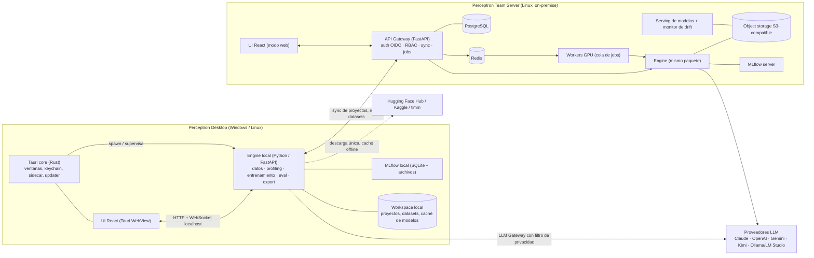
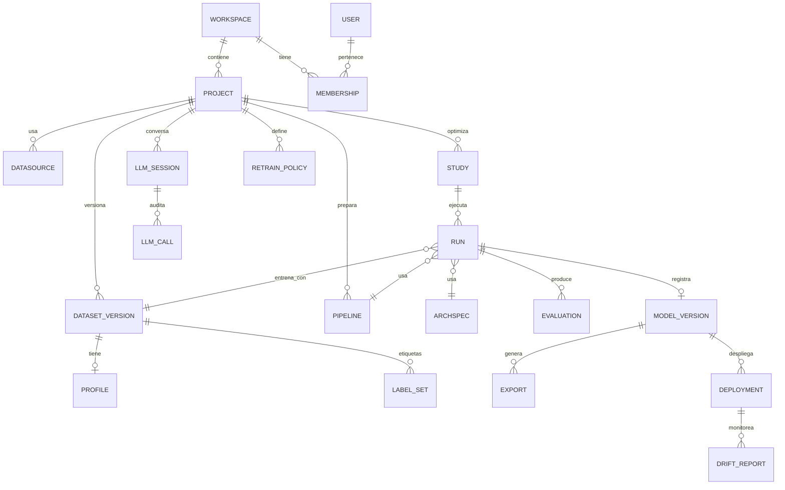
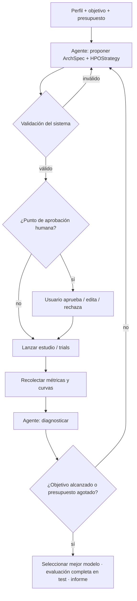

# Perceptron — Especificación del sistema

> Plataforma de escritorio + servidor de equipo para **entrenar redes neuronales localmente**, donde un LLM guía al usuario desde los datos crudos hasta un modelo evaluado, explicado, exportado y monitoreado.
>
> **Producto:** Preteco · **Versión del documento:** 1.0 · **Fecha:** 2026-09-26 · **Autor:** Alejandro Schneider (Director de Innovación & Delivery)
>
> Este documento está escrito para ser consumido por **Claude Code** como fuente de verdad para construir el sistema desde cero. Ver [§18](#18-cómo-usar-este-documento-con-claude-code) para el flujo de trabajo recomendado.

---

## Índice

1. [Visión y objetivos](#1-visión-y-objetivos)
2. [Decisiones de alcance](#2-decisiones-de-alcance)
3. [Usuarios, roles y casos de uso](#3-usuarios-roles-y-casos-de-uso)
4. [Arquitectura general](#4-arquitectura-general)
5. [Stack tecnológico](#5-stack-tecnológico)
6. [Modelo de dominio](#6-modelo-de-dominio)
7. [Módulos funcionales](#7-módulos-funcionales)
8. [Catálogo de arquitecturas](#8-catálogo-de-arquitecturas)
9. [ArchSpec: lenguaje declarativo de arquitecturas](#9-archspec-lenguaje-declarativo-de-arquitecturas)
10. [API del Engine y del Team Server](#10-api-del-engine-y-del-team-server)
11. [UI/UX y marca](#11-uiux-y-marca)
12. [Estructura del repositorio](#12-estructura-del-repositorio)
13. [Requisitos no funcionales](#13-requisitos-no-funcionales)
14. [Plan de construcción por capas](#14-plan-de-construcción-por-capas)
15. [Estrategia de testing](#15-estrategia-de-testing)
16. [Riesgos y mitigaciones](#16-riesgos-y-mitigaciones)
17. [Decisiones abiertas](#17-decisiones-abiertas)
18. [Cómo usar este documento con Claude Code](#18-cómo-usar-este-documento-con-claude-code)
19. [Glosario](#19-glosario)

---

## 1. Visión y objetivos

### 1.1 Problema
Entrenar una red neuronal útil para un caso específico (clasificar tickets, detectar fallas por sonido, pronosticar demanda, inspeccionar piezas por imagen) exige hoy conocimiento experto en: preparación de datos, elección de arquitectura, búsqueda de hiperparámetros, diagnóstico de entrenamiento, evaluación y puesta en producción. Las plataformas AutoML existentes suelen ser cloud (los datos salen de la organización), cajas negras o solo tabulares.

### 1.2 Propuesta
**Perceptron** es una aplicación de escritorio (Windows/Linux) con un servidor de equipo opcional que:

1. **Ingiere** datos tabulares, imágenes, texto, series temporales y audio desde archivos, bases de datos, datasets públicos y APIs.
2. **Perfila** el dataset (calidad, desbalance, leakage, tamaño, modalidad) y propone un pipeline de preparación editable.
3. **Asiste el etiquetado** con pre-etiquetas automáticas y active learning.
4. Mediante un **LLM copiloto**, conversa con el usuario para entender el objetivo, **propone la arquitectura óptima** (expresada en un lenguaje declarativo validado — ArchSpec — o en código PyTorch en modo experto) y **define la estrategia de optimización de hiperparámetros** adecuada al escenario.
5. **Entrena localmente** sobre el hardware disponible (CUDA, ROCm, Intel XPU o CPU), con un **ciclo iterativo autónomo** opcional: proponer → entrenar → evaluar → diagnosticar → re-proponer, dentro de un presupuesto.
6. **Evalúa** con métricas por tarea, explicabilidad, análisis de errores, fairness y robustez, y genera un **informe en lenguaje natural**.
7. **Exporta** el modelo (ONNX, TorchScript/torch.export), genera una **API REST de inferencia**, un **playground** y un **proyecto de código standalone** reproducible.
8. **Monitorea** modelos en uso (drift), **reentrena** automáticamente y **versiona** datasets.

### 1.3 Objetivos medibles (v1.0)
| # | Objetivo | Métrica |
|---|----------|---------|
| O1 | Un usuario sin conocimientos de ML entrena un modelo tabular o de imágenes útil | < 15 min desde "Nuevo proyecto" hasta modelo evaluado, sin escribir código |
| O2 | La propuesta del LLM es competitiva | En el benchmark interno (§15.4), el mejor modelo del ciclo autónomo queda dentro del 5 % de la mejor configuración manual conocida |
| O3 | Reproducibilidad | Re-ejecutar un run con la misma semilla, datos y ArchSpec produce métricas dentro de ±0,5 % (±2 % en GPU no determinística) |
| O4 | Privacidad | Cero bytes de datos crudos salen de la máquina si el nivel de privacidad del proyecto es ≤ L1 (verificable en el log de auditoría) |
| O5 | Portabilidad | El proyecto exportado corre `train` e `infer` en una máquina limpia con `uv sync` |

### 1.4 Fuera de alcance (v1.0)
- Entrenamiento distribuido multi-nodo (sí multi-GPU en un mismo nodo, ver §7.10).
- Modelos generativos grandes (entrenar LLMs, difusión). Se permite fine-tuning de encoders medianos.
- macOS (evaluar para v2; la arquitectura no debe impedirlo).
- Apps móviles.

---

## 2. Decisiones de alcance

Resultado del cuestionario de alcance. Estas decisiones son **vinculantes**; cualquier desvío debe registrarse como ADR (§18.3).

| Tema | Decisión |
|------|----------|
| Usuario objetivo | **Mixto**: modo guiado (AutoML asistido) para no expertos + modo experto con control total |
| Modalidades de datos | Tabular (CSV/Excel), Imágenes, Texto, Series temporales, **Audio** |
| Tareas | Clasificación, Regresión, Forecasting, Detección de anomalías, Visión avanzada (detección, segmentación, OCR), **Detección de patrones de audio** |
| Interfaz | **App de escritorio** (Tauri) + la misma UI servida como **web** por el Team Server (el servidor funciona como estación de trabajo) + CLI |
| Sistemas operativos | **Windows 10/11 y Linux** |
| Hardware | **Selección según hardware disponible**: detección automática de CUDA / ROCm / Intel XPU / CPU; el usuario elige dispositivo |
| Stack desktop | **Tauri 2 + React + TypeScript**, backend **Python (FastAPI)** como sidecar |
| Framework DL | **PyTorch + PyTorch Lightning** |
| Propuesta de arquitectura | **Asistida por LLM**: el LLM analiza el perfil del dataset y el objetivo, y propone arquitecturas; además un **wizard guía la definición de la arquitectura** |
| Materialización | **Ambos**: ArchSpec declarativa validada (por defecto) + código PyTorch libre en sandbox (modo experto) |
| Preentrenados | **Sí, con caché offline** (Hugging Face Hub, timm, torchvision, torchaudio) |
| HPO | **Seleccionable según escenario**; el **LLM analiza y recomienda la mejor estrategia** (Optuna TPE/CMA-ES/NSGA-II, ASHA/Hyperband, grid, random, Ray Tune en servidor) |
| Presupuesto | **Configurable en el wizard**: tiempo, nº de trials, perfil preset, métrica objetivo, costo de LLM |
| Proveedor LLM | **Pluggable**: Anthropic Claude (default), OpenAI, Google Gemini, Kimi (Moonshot, API compatible OpenAI) y **locales** (Ollama / LM Studio / llama.cpp) |
| Privacidad frente al LLM | **Configurable por proyecto** (niveles L0–L3, §7.7.3) |
| Rol del LLM | Copiloto del wizard · Guía de definición de arquitectura · Diagnóstico de entrenamiento · Ciclo iterativo autónomo · Informe final explicado |
| Fuentes de datos | Archivos locales, Bases de datos, Datasets públicos (HF, Kaggle), APIs / streaming |
| Preparación de datos | Profiling y calidad · Limpieza/transformación automática · Data augmentation · **Editor visual de pipeline** |
| Etiquetado | **Asistido por LLM/modelo** (pre-etiquetado + corrección humana + active learning) |
| Volumen | **Hasta ~10 GB por proyecto** (streaming desde disco, sin cargar todo en memoria) |
| Tracking | **MLflow embebido** (local: SQLite; servidor: PostgreSQL + S3) |
| Evaluación | Métricas y gráficos por tarea · Explicabilidad · Análisis de errores · Fairness / robustez |
| Uso del modelo | ONNX / TorchScript / torch.export · API REST de inferencia · Playground · Proyecto de código exportable |
| Ciclo de vida | **Completo**: drift, alertas, reentrenamiento automático (incl. fuentes streaming), versionado de datasets |
| Usuarios | **Equipo con servidor compartido**; entrenamiento **híbrido** (desktop local y/o servidor como worker y como estación de trabajo) |
| Autenticación | **Usuarios locales + SSO OIDC** (Entra ID, Google Workspace), roles Admin / Editor / Viewer |
| Marca / idioma | **Producto Preteco** según Manual de Marca; **i18n español + inglés** |
| Construcción | **Por capas técnicas** (§14) |
| Distribución | **Producto comercial**; modelo de licenciamiento **a definir** — dejar hooks en la arquitectura (§7.17) |
| Nombre | **Perceptron** |

---

## 3. Usuarios, roles y casos de uso

### 3.1 Personas
| Persona | Descripción | Modo por defecto |
|---------|-------------|------------------|
| **Analista de negocio** | Conoce el problema y los datos, no programa | Guiado; LLM decide casi todo; ve explicaciones |
| **Desarrollador** | Programa, no es experto en ML | Guiado con acceso a ArchSpec y parámetros |
| **Data scientist / ML engineer** | Quiere control fino, reproducibilidad, comparar | Experto: edita ArchSpec, código PyTorch, espacios de búsqueda |
| **Admin de plataforma** | Gestiona servidor, usuarios, proveedores LLM, cuotas | Consola de administración |

### 3.2 Roles (Team Server)
| Rol | Permisos |
|-----|----------|
| **Admin** | Todo + gestión de usuarios, SSO, proveedores LLM y claves, cuotas de GPU/LLM, políticas de privacidad máximas, licencias |
| **Editor** | Crear/editar proyectos del workspace, lanzar entrenamientos, exportar, desplegar serving |
| **Viewer** | Ver proyectos, runs, informes; usar playground; no entrenar ni exportar |

Permisos a nivel **workspace** y **proyecto** (un usuario puede ser Editor en un proyecto y Viewer en otro).

### 3.3 Casos de uso de referencia (usar como tests end-to-end)
| ID | Caso | Modalidad | Tarea |
|----|------|-----------|-------|
| UC-01 | Predecir churn de clientes desde un Excel | Tabular | Clasificación binaria |
| UC-02 | Estimar tiempo de resolución de tickets | Tabular + texto | Regresión |
| UC-03 | Clasificar tickets de soporte por categoría | Texto (ES) | Clasificación multiclase |
| UC-04 | Inspección visual de defectos en piezas | Imagen | Clasificación + detección |
| UC-05 | Segmentar zonas de daño en fotos | Imagen | Segmentación |
| UC-06 | Extraer texto de remitos escaneados | Imagen | OCR |
| UC-07 | Pronosticar demanda semanal por SKU | Serie temporal | Forecasting multi-serie |
| UC-08 | Detectar anomalías en telemetría de sensores | Serie temporal | Anomalías |
| UC-09 | Detectar fallas de motor por sonido | Audio | Clasificación / detección de eventos sonoros |
| UC-10 | Reentrenar UC-01 automáticamente cuando hay drift | Tabular | MLOps |

---

## 4. Arquitectura general

### 4.1 Vista de componentes



### 4.2 Principios de arquitectura
1. **Un solo Engine.** El mismo paquete Python (`perceptron-engine`) corre en el desktop y en el servidor. La UI solo habla HTTP/WebSocket con un Engine; no sabe si es local o remoto.
2. **Una sola UI.** El frontend React se compila dos veces: embebido en Tauri y como SPA servida por el Team Server. Las diferencias (keychain, diálogos nativos, auto-update) se aíslan detrás de una interfaz `PlatformBridge`.
3. **Headless primero.** Todo lo que hace la UI se puede hacer por API y CLI (`perceptron ...`). La UI nunca contiene lógica de ML.
4. **Declarativo por defecto.** Arquitecturas, pipelines de datos, estrategias de HPO y presupuestos son documentos JSON validados por schema (Pydantic ⇄ JSON Schema ⇄ tipos TypeScript generados). El código libre es opt-in y corre en sandbox.
5. **El LLM propone, el sistema valida.** Toda salida del LLM pasa por validación de schema, chequeos de factibilidad (memoria, compatibilidad de shapes, hardware) y, según configuración, aprobación humana.
6. **Privacidad por diseño.** Todo lo que sale hacia un LLM pasa por el `PrivacyFilter` del LLM Gateway y queda registrado en un log de auditoría consultable.
7. **Offline-capable.** Con un LLM local y modelos preentrenados cacheados, el sistema funciona sin internet.
8. **Reproducible.** Cada run guarda: hash del snapshot del dataset, pipeline, ArchSpec, HPO config, semillas, versiones de librerías, hardware y (si aplica) los prompts/respuestas del LLM que lo originaron.

### 4.3 Topología de ejecución (híbrida)
| Modo | Dónde corre la UI | Dónde corre el Engine | Dónde se entrena |
|------|-------------------|-----------------------|------------------|
| **Standalone** | Desktop | Desktop | Desktop |
| **Conectado** | Desktop | Desktop + Server | Desktop o Server (el usuario elige por run; el servidor como worker GPU) |
| **Estación en servidor** | Navegador → Server (UI web) | Server | Server |

Un proyecto es **local** (vive solo en el desktop) o **de equipo** (vive en el servidor, con copia de trabajo local). Los runs de proyectos de equipo se registran en el MLflow del servidor, se ejecuten donde se ejecuten.

---

## 5. Stack tecnológico

> Fijar versiones exactas en `pyproject.toml` / `package.json` / `Cargo.toml` al iniciar la Capa 0, usando las versiones estables vigentes en ese momento. Revisar la **licencia** de cada dependencia: el producto es comercial (ver §16).

### 5.1 Engine (Python)
| Área | Elección | Notas |
|------|----------|-------|
| Lenguaje / entorno | Python 3.12+, **uv** | uv también gestiona el runtime embebido en el instalador |
| API | FastAPI + Uvicorn, Pydantic v2 | WebSocket para progreso en vivo |
| DL | PyTorch + **Lightning** | `LightningModule` generado desde ArchSpec |
| Visión | torchvision, **timm** | Detección/segmentación con modelos de licencia permisiva |
| Texto | Hugging Face **transformers**, **tokenizers**, datasets | Encoders multilingües/ES |
| Audio | **torchaudio** | Mel-spectrogram, MFCC, augmentations |
| Series temporales | Implementaciones propias en PyTorch (TCN, N-BEATS/N-HiTS, PatchTST, TFT) | Evaluar librerías con licencia compatible |
| Tabular | Pandas / **Polars**, PyArrow, scikit-learn (preprocesado, métricas) | LightGBM solo como **baseline de referencia** |
| HPO | **Optuna** (default), Ray Tune (opcional en servidor multi-GPU) | |
| Tracking | **MLflow** | |
| Explicabilidad | **Captum**, **SHAP** | |
| Fairness | **Fairlearn** | |
| Drift | **Evidently** (tabular) + métricas propias sobre embeddings | |
| PII | **Microsoft Presidio** | Anonimización para privacidad L2 |
| Export | torch.onnx (dynamo), torch.export, TorchScript (legacy), **ONNX Runtime** | |
| LLM | Gateway propio con adaptadores (se puede apoyar en **LiteLLM**) | §7.7 |
| Conectores DB | SQLAlchemy 2 + drivers (pyodbc/SQL Server, psycopg, PyMySQL, sqlite) | |
| Jobs locales | Gestor propio de subprocesos | un proceso por run (aislamiento de CUDA y crashes) |
| CLI | Typer | |
| Lint / tipos / tests | Ruff, mypy (strict en `core`), pytest, hypothesis | |

### 5.2 Frontend
| Área | Elección |
|------|----------|
| Framework | React 19 + TypeScript (strict) + Vite |
| Routing / datos | TanStack Router, **TanStack Query** |
| Estado de UI | Zustand |
| Componentes | shadcn/ui (Radix) + Tailwind, tematizado con tokens Preteco (§11) |
| Editor de grafos (pipeline y arquitectura) | **React Flow (xyflow)** |
| Gráficos | **Apache ECharts** (curvas de entrenamiento en vivo, matrices, ROC) |
| Editor de código (modo experto) | Monaco |
| Formularios | React Hook Form + Zod (schemas generados desde JSON Schema) |
| i18n | i18next (es, en) |
| Tipos del API | Generados desde OpenAPI (`openapi-typescript`) |
| Tests | Vitest, Testing Library, **Playwright** (E2E) |

### 5.3 Desktop
| Área | Elección |
|------|----------|
| Shell | **Tauri 2** (Rust) |
| Sidecar | Engine Python lanzado por Tauri en puerto aleatorio de `127.0.0.1` con token efímero |
| Secretos | Keychain del SO (Windows Credential Manager / Secret Service) vía plugin Tauri |
| Instaladores | MSI/NSIS (Windows), AppImage + .deb (Linux) |
| Actualizaciones | Tauri updater (firmado) |

### 5.4 Team Server
| Área | Elección |
|------|----------|
| API | FastAPI (mismo repo), OIDC con **Authlib**, sesiones JWT |
| DB | PostgreSQL 16+ (SQLAlchemy + Alembic) |
| Objetos | Almacenamiento **S3-compatible** configurable (evaluar licencia del servidor elegido, §16) |
| Cola | Redis + **Celery** (o Dramatiq; decidir en ADR) con colas por tipo de recurso (`gpu`, `cpu`, `llm`) |
| Tracking | MLflow server (backend PostgreSQL, artefactos S3) |
| Despliegue | Docker Compose (v1) y Helm chart (v1.x); imágenes CUDA y CPU |
| Observabilidad | OpenTelemetry, Prometheus, logs JSON estructurados |

---

## 6. Modelo de dominio



### 6.1 Entidades principales
| Entidad | Campos clave |
|---------|--------------|
| `Project` | id, nombre, descripción del objetivo (texto libre del usuario), modalidad(es), tarea, métrica objetivo, `privacy_level`, `llm_profile_id`, `scope` (local \| team), estado |
| `DataSource` | tipo (file, folder, db, hf, kaggle, api, stream), config (sin secretos; secretos por referencia a keychain/vault), esquema inferido |
| `DatasetVersion` | hash de contenido (manifiesto), n.º de muestras, splits (train/val/test y/o folds, temporales si aplica), origen, padre, fecha |
| `Profile` | estadísticas por columna/modalidad, alertas de calidad, desbalance, sospechas de leakage, estimación de complejidad |
| `LabelSet` | tipo (clase, multi-etiqueta, cajas, máscaras, eventos temporales), origen de cada etiqueta (humano, modelo, LLM), confianza |
| `Pipeline` | grafo de pasos (DAG) de preprocesamiento + augmentation, serializado (§7.4) |
| `ArchSpec` | documento declarativo de arquitectura (§9) o referencia a código experto, + hash |
| `Study` | estrategia HPO, espacio de búsqueda, presupuesto, objetivo(s), `origin` (manual \| llm \| agent) |
| `Run` | estado, dispositivo, hiperparámetros, métricas, curvas, checkpoints, `mlflow_run_id`, semillas, entorno, diagnóstico LLM |
| `ModelVersion` | run origen, stage (candidate, staging, production, archived), firma de entrada/salida, tarjeta de modelo |
| `Export` | formato (onnx, torchscript, torch_export, rest_api, code_project), ruta, checksums |
| `Deployment` | endpoint, host (desktop/servidor), versión, políticas de monitoreo |
| `DriftReport` | ventana, métricas de drift por feature/embedding, severidad, acción disparada |
| `RetrainPolicy` | disparadores (drift, calendario, volumen nuevo, degradación de métrica), aprobación requerida, presupuesto |
| `LLMSession` / `LLMCall` | proveedor, modelo, propósito, payload enviado (post-filtro), respuesta, tokens, costo estimado, nivel de privacidad aplicado |

### 6.2 Almacenamiento local (desktop)
```
<workspace>/                         # configurable, default: %LOCALAPPDATA%\Perceptron o ~/.local/share/perceptron
  perceptron.db                      # SQLite: metadata de proyectos, auditoría LLM, configuración
  mlflow/                            # backend SQLite + artefactos
  cache/models/                      # HF / timm / torchvision (caché offline compartido)
  projects/<project_id>/
    project.json
    datasets/<version_hash>/         # manifiesto + datos materializados (Parquet / shards)
    labels/
    pipelines/*.json
    archspecs/*.json | code/*.py
    runs/<run_id>/                   # checkpoints, logs (además de MLflow)
    exports/
```

---

## 7. Módulos funcionales

Cada módulo lista **requisitos funcionales (RF)** numerados. Las RF marcadas **[MVP]** deben estar en la primera versión utilizable de su capa.

### 7.1 Gestión de proyectos
- **RF-PRJ-01 [MVP]** Crear, abrir, duplicar, archivar y eliminar proyectos.
- **RF-PRJ-02 [MVP]** Plantillas de proyecto por caso de uso (UC-01…UC-09) que preconfiguran modalidad, tarea y métrica.
- **RF-PRJ-03** Exportar/importar proyecto como paquete `.perceptron` (zip con manifiesto; datos opcionales).
- **RF-PRJ-04** Promover un proyecto local a proyecto de equipo (sube metadata, datasets y runs seleccionados).
- **RF-PRJ-05** Historial de actividad del proyecto (quién hizo qué, cuándo).

### 7.2 Ingesta de datos
- **RF-ING-01 [MVP]** Archivos locales: CSV, TSV, XLSX, Parquet, JSON/JSONL; carpetas de imágenes (estructura `clase/archivo` o con archivo de anotaciones), audio (WAV, FLAC, MP3, OGG), texto (TXT, JSONL, CSV con columna de texto), ZIP.
- **RF-ING-02** Formatos de anotación: COCO, Pascal VOC, YOLO (txt), máscaras PNG, CSV de eventos de audio (inicio, fin, etiqueta).
- **RF-ING-03** Bases de datos: SQL Server, PostgreSQL, MySQL/MariaDB, SQLite, vía query SQL con vista previa y límite; lectura por chunks.
- **RF-ING-04** Datasets públicos: Hugging Face Datasets y Kaggle (con credenciales del usuario), descarga a caché.
- **RF-ING-05** APIs REST (paginación, auth por header/token, mapeo JSON → tabla) y **streaming** (Kafka, MQTT, WebSocket; interfaz `StreamSource` extensible) para acumular datos nuevos y alimentar reentrenamiento (§7.15).
- **RF-ING-06 [MVP]** Inferencia de esquema y tipos (numérico, categórico, fecha, texto, id, ruta de archivo, target candidato) con corrección manual.
- **RF-ING-07 [MVP]** Cada ingesta crea un `DatasetVersion` inmutable con hash de contenido.
- **RF-ING-08 [MVP]** Particionado: aleatorio estratificado, por grupo (evitar leakage entre entidades), **temporal** (series y datos con fecha), k-fold. Test set sellado: no se usa en HPO.
- **RF-ING-09** Soporte hasta ~10 GB: los datos no tabulares se leen en streaming desde disco; los tabulares grandes se materializan en Parquet y se leen con Polars/Arrow por lotes; shards para imágenes/audio si hace falta.

### 7.3 Profiling y calidad
- **RF-PRF-01 [MVP]** Estadísticas por columna (tabular): tipo, nulos, cardinalidad, distribución, outliers, correlaciones con el target.
- **RF-PRF-02 [MVP]** Imágenes: resolución, canales, formatos, corruptas, duplicados/casi-duplicados (hash perceptual), balance de clases.
- **RF-PRF-03** Texto: idioma, longitud en tokens, vocabulario, duplicados, balance.
- **RF-PRF-04** Series: frecuencia, gaps, estacionalidad, tendencia, número de series, horizonte factible.
- **RF-PRF-05** Audio: duración, sample rate, canales, silencio, clipping, SNR estimado.
- **RF-PRF-06 [MVP]** Alertas: desbalance, target con fuga (feature casi idéntica al target, ids, fechas futuras), columnas constantes, datos insuficientes para la tarea.
- **RF-PRF-07 [MVP]** Genera un **Dataset Profile Card** (JSON + vista) que es la entrada principal del LLM en niveles de privacidad L1+.
- **RF-PRF-08** Estimación de complejidad y costo: tamaño efectivo, memoria estimada por batch, tiempo estimado por época por arquitectura candidata y dispositivo.

### 7.4 Pipeline de preparación (editor visual)
- **RF-PIP-01 [MVP]** El sistema propone automáticamente un pipeline según profiling (imputación, encoding, escalado, tokenización, resize/normalización, espectrogramas, ventaneo de series).
- **RF-PIP-02** **Editor visual** (React Flow) de un DAG de pasos: agregar, quitar, reordenar, parametrizar; vista previa del resultado sobre una muestra en cada nodo.
- **RF-PIP-03** Catálogo de pasos por modalidad (extensible por plugins):
  - Tabular: imputación (media/mediana/moda/constante/KNN), one-hot, ordinal, target encoding (con CV), embeddings categóricos, escalado (standard/robust/min-max/quantile), log/Box-Cox, features de fecha, eliminación de columnas, filtros de outliers.
  - Imagen: resize, crop, normalización, conversión de color; **augmentation**: flip, rotación, color jitter, random resized crop, cutout, mixup/cutmix, RandAugment/TrivialAugment.
  - Texto: limpieza, normalización, tokenización (del modelo elegido), truncado/ventaneo; augmentation: back-translation (vía modelo local), sinónimos, EDA.
  - Series: remuestreo, relleno de gaps, escalado por serie, lags, ventanas, features de calendario; augmentation: jitter, scaling, window warping.
  - Audio: resample, mono, recorte/padding, mel-spectrogram/MFCC, normalización; augmentation: ruido, time/pitch shift, SpecAugment, mezcla de fondos.
- **RF-PIP-04 [MVP]** El pipeline se serializa (JSON) y se ajusta **solo con train** (fit/transform separado) para evitar leakage; se empaqueta junto al modelo en los exports.
- **RF-PIP-05** El LLM puede sugerir cambios al pipeline con justificación; el usuario acepta/rechaza cada sugerencia (diff visual).

### 7.5 Etiquetado asistido
- **RF-LBL-01** Herramientas de etiquetado: clase por muestra (imagen/texto/audio), multi-etiqueta, cajas, polígonos/máscaras (pincel), segmentos temporales en audio y series (sobre forma de onda/espectrograma).
- **RF-LBL-02** **Pre-etiquetado automático** con:
  - modelos zero-shot locales (p. ej. CLIP-like para imágenes, NLI/embeddings para texto, CLAP-like para audio — verificar licencias),
  - el **LLM** (para texto, y para imágenes si el proveedor es multimodal y el nivel de privacidad lo permite),
  - el modelo del propio proyecto una vez entrenado.
- **RF-LBL-03** **Active learning**: priorizar para revisión humana las muestras de mayor incertidumbre/diversidad; ciclo etiquetar → reentrenar → re-priorizar.
- **RF-LBL-04** Guía de etiquetado: el usuario describe las clases en lenguaje natural; el LLM genera definiciones y ejemplos límite que se usan en el prompt de pre-etiquetado.
- **RF-LBL-05** Métricas de calidad del etiquetado: acuerdo humano-modelo, clases confusas, posibles errores de etiqueta (confident learning).
- **RF-LBL-06** Importar/exportar etiquetas en COCO, YOLO, VOC, CSV, JSONL.

### 7.6 Wizard de creación de la red neuronal
Flujo guiado, persistente (se puede cerrar y retomar) y con un **panel de copiloto LLM** siempre visible. En modo experto todos los pasos muestran controles avanzados.

| Paso | Contenido | Rol del LLM |
|------|-----------|-------------|
| 1. **Objetivo** | El usuario describe en lenguaje natural qué quiere lograr ("detectar si un rodamiento está por fallar a partir del sonido") | Conversa, hace preguntas de aclaración, infiere modalidad, tarea, métrica de negocio y restricciones (latencia, tamaño, explicabilidad) |
| 2. **Datos** | Selección/ingesta de fuentes, mapeo de target, splits | Sugiere target, estrategia de split (p. ej. temporal si hay fechas), alerta sobre leakage |
| 3. **Calidad y preparación** | Profile Card, alertas, pipeline propuesto, editor visual | Explica alertas en lenguaje simple, propone correcciones |
| 4. **Etiquetado** (si faltan etiquetas) | Pre-etiquetado + revisión | Genera guía de etiquetado, pre-etiqueta |
| 5. **Tarea y métrica** | Tipo de tarea, métrica de optimización y secundarias, umbrales de éxito | Traduce la métrica de negocio a métrica técnica (p. ej. recall de la clase "falla" ≥ 0,95) |
| 6. **Arquitectura** | 2–4 **propuestas** del LLM con justificación, pros/contras, tamaño, tiempo estimado; **wizard de definición** paso a paso (familia → backbone → cabeza → regularización); editor visual de bloques ArchSpec; editor de código (experto) | Propone, explica y guía; responde "¿por qué esta y no otra?" |
| 7. **Estrategia de HPO** | Estrategia recomendada, espacio de búsqueda editable, pruning, multi-objetivo | Analiza el escenario y recomienda (§7.9) |
| 8. **Presupuesto y hardware** | Tiempo máximo, n.º de trials, preset (Rápido/Balanceado/Exhaustivo), métrica objetivo para cortar, **presupuesto de LLM** (tokens/costo), dispositivo (local/servidor, GPU/CPU), modo autónomo on/off y puntos de aprobación | Advierte si el presupuesto es insuficiente para la arquitectura elegida |
| 9. **Revisión y lanzamiento** | Resumen de todo, estimaciones, botón "Entrenar" | Resume en un párrafo lo que va a pasar |

- **RF-WIZ-01 [MVP]** Pasos 1, 2, 3, 5, 6, 7, 8, 9 para tabular e imagen.
- **RF-WIZ-02** Cada paso muestra "¿Por qué?" con la explicación del LLM y permite rechazar/editar.
- **RF-WIZ-03** Sin LLM configurado (o privacidad L0) el wizard funciona con **recomendaciones por reglas** (catálogo §8) como fallback.
- **RF-WIZ-04** El estado del wizard es un documento `ProjectDraft` versionado.

### 7.7 Capa LLM

#### 7.7.1 LLM Gateway
- **RF-LLM-01 [MVP]** Interfaz única `LLMProvider` con adaptadores: **Anthropic**, **OpenAI**, **Google Gemini**, **Kimi / Moonshot** (compatible OpenAI), **OpenAI-compatible genérico** (LM Studio, vLLM, llama.cpp server) y **Ollama**.
- **RF-LLM-02 [MVP]** Capacidades declaradas por modelo: `structured_output`, `tool_use`, `vision`, `context_window`, `cost_per_token`. El sistema degrada funciones según capacidades (p. ej. sin `vision` no se pre-etiquetan imágenes con el LLM).
- **RF-LLM-03 [MVP]** **Perfiles LLM** configurables: qué modelo se usa para cada *propósito* (`copilot`, `architect`, `hpo_strategist`, `diagnostician`, `agent`, `reporter`, `labeler`). Los IDs de modelo **no se hardcodean**: viven en configuración con un catálogo actualizable.
- **RF-LLM-04 [MVP]** Salida estructurada: toda respuesta que alimenta al sistema se pide como JSON contra un JSON Schema (tool calling o modo JSON), se valida con Pydantic y se reintenta con el error de validación (máx. 3).
- **RF-LLM-05** Streaming de respuestas al panel de copiloto.
- **RF-LLM-06** Control de costos: presupuesto por proyecto/run/usuario, conteo de tokens, estimación de costo, corte al alcanzar el límite. Cuotas por workspace en el servidor.
- **RF-LLM-07** Caché de respuestas por hash de (prompt, modelo, parámetros) para reproducibilidad y ahorro.
- **RF-LLM-08** Claves API: en desktop, keychain del SO; en servidor, cifradas (AES-GCM, clave maestra en variable de entorno o KMS). El Admin puede imponer proveedores permitidos.

#### 7.7.2 Prompts
- Versionados como archivos en `engine/perceptron/llm/prompts/<propósito>/<versión>.md` con front-matter (schema de salida, variables).
- Cada `LLMCall` registra la versión del prompt.
- Los prompts reciben siempre: Dataset Profile Card (según privacidad), objetivo del usuario, restricciones, hardware disponible, catálogo de bloques ArchSpec permitido y (si aplica) historial de runs.
- **Golden tests** de prompts (§15.3).

#### 7.7.3 Niveles de privacidad (por proyecto)
| Nivel | Qué recibe el LLM | Uso típico |
|-------|-------------------|------------|
| **L0 — Sin LLM** | Nada. Se usan reglas del catálogo | Datos altamente sensibles, sin LLM local |
| **L1 — Metadatos** (default) | Esquema, estadísticas agregadas, distribución de clases, tamaños, métricas y curvas de entrenamiento. **Nunca valores individuales** | Mayoría de proyectos |
| **L2 — Muestras anonimizadas** | L1 + N muestras (configurable) con PII enmascarada por Presidio + reglas del usuario; valores numéricos con ruido opcional | Mejor comprensión semántica (texto, tabular) |
| **L3 — Muestras crudas** | L2 sin anonimización, incluidas imágenes/audio si el modelo es multimodal | Datos no sensibles o LLM local |

- **RF-PRV-01 [MVP]** El `PrivacyFilter` se aplica en el Gateway (no en cada llamador).
- **RF-PRV-02** Con un **LLM local** el Admin puede permitir L3 aunque la política general sea L1.
- **RF-PRV-03 [MVP]** **Log de auditoría**: el usuario puede ver exactamente qué payload se envió en cada llamada, a qué proveedor y modelo.
- **RF-PRV-04** Política de workspace: nivel máximo permitido y proveedores permitidos, definidos por el Admin.

#### 7.7.4 Roles del LLM
| Rol | Entrada | Salida (schema) |
|-----|---------|-----------------|
| **Copiloto del wizard** | Conversación + estado del `ProjectDraft` | Mensajes + `DraftPatch` (cambios sugeridos al borrador) |
| **Arquitecto** | Profile Card, objetivo, restricciones, hardware, catálogo | `ArchProposal[]`: ArchSpec, justificación, riesgos, estimación de parámetros, confianza |
| **Guía de definición** | Paso actual del sub-wizard de arquitectura | Opciones explicadas para ese paso |
| **Estratega de HPO** | Profile Card, ArchSpec, presupuesto, hardware | `HPOStrategy` (§7.9) |
| **Diagnosticador** | Curvas (loss/métricas por época), gradientes/LR, uso de recursos, config | `Diagnosis`: problemas detectados (overfitting, underfitting, divergencia, LR mal calibrado, desbalance, cuello de botella de datos), evidencia, acciones sugeridas |
| **Agente autónomo** | Todo lo anterior + historial del estudio | Acciones vía herramientas (§7.11) |
| **Informante** | Resultados de evaluación, explicabilidad, fairness | `Report` (Markdown) + model card |
| **Etiquetador** | Guía de etiquetado + muestras (según privacidad) | Etiquetas + confianza |

### 7.8 Recomendación de arquitectura
- **RF-ARC-01 [MVP]** El LLM genera **2–4 propuestas** usando exclusivamente bloques del catálogo (§8) en ArchSpec (§9). Cada propuesta incluye justificación, n.º de parámetros estimado, memoria y tiempo por época estimados en el hardware elegido.
- **RF-ARC-02 [MVP]** **Validación** de cada propuesta: schema, compatibilidad de shapes (construcción en `meta` device + forward de prueba), memoria estimada vs. disponible, preentrenados disponibles en caché o descargables, licencia del peso compatible con el uso declarado.
- **RF-ARC-03** **Mini-torneo** opcional: entrenar cada propuesta con un presupuesto corto (p. ej. 10 % del total, subconjunto de datos) y avanzar la mejor al HPO completo.
- **RF-ARC-04 [MVP]** Fallback por reglas si el LLM no está disponible o falla la validación 3 veces.
- **RF-ARC-05** **Editor visual de ArchSpec** (React Flow): bloques del catálogo como nodos, parámetros en panel lateral, validación en vivo, resumen de parámetros/FLOPs.
- **RF-ARC-06** **Modo experto — código libre**: el LLM (o el usuario) escribe un `LightningModule`/`nn.Module` que respeta una interfaz fija (`build_model(config) -> nn.Module`, `input_spec`, `output_spec`). Se ejecuta en **sandbox** (§13.2), requiere confirmación explícita y queda marcado como "no declarativo" en el run.
- **RF-ARC-07** Conversión ArchSpec → código PyTorch legible ("ver como código") para aprendizaje y para el proyecto exportable.

### 7.9 Estrategia de optimización de hiperparámetros
- **RF-HPO-01 [MVP]** Estrategias soportadas:

| Estrategia | Cuándo conviene (heurística base que el LLM puede refinar) |
|------------|------------------------------------------------------------|
| Evaluación única con defaults sólidos | Presupuesto muy bajo o fine-tuning de preentrenado con receta conocida |
| Random search | Espacios grandes, presupuesto bajo, baseline |
| Grid search | ≤ 3 hiperparámetros discretos, exploración didáctica |
| **Optuna TPE** (default) | Caso general, espacios mixtos |
| Optuna CMA-ES | Espacios continuos, presupuesto medio/alto |
| Optuna NSGA-II / multi-objetivo | Trade-off precisión vs. latencia/tamaño |
| **ASHA / Hyperband** (pruners) | Entrenamientos largos donde las curvas tempranas predicen el resultado |
| Population Based Training (Ray Tune, servidor) | Multi-GPU, schedules de LR/augmentation |

- **RF-HPO-02 [MVP]** El **LLM estratega** recibe el escenario (tamaño de datos, costo por trial, presupuesto, n.º de hiperparámetros, hardware, objetivo multi/mono) y devuelve `HPOStrategy`: estrategia, sampler, pruner, espacio de búsqueda (rangos, escalas log, condicionales), n.º de trials/tiempo, paralelismo, justificación. El usuario puede aceptarla o editarla.
- **RF-HPO-03 [MVP]** Presupuesto configurable en el wizard: tiempo total, n.º de trials, preset, métrica objetivo de parada, presupuesto LLM; lo que ocurra primero corta el estudio.
- **RF-HPO-04** Paralelismo de trials según recursos: varias GPUs → un trial por GPU; en servidor, distribución por la cola de workers.
- **RF-HPO-05** Reanudación de estudios interrumpidos (almacenamiento Optuna en SQLite/PostgreSQL).
- **RF-HPO-06** Visualizaciones: historia de optimización, importancia de hiperparámetros, coordenadas paralelas, frente de Pareto.

### 7.10 Motor de entrenamiento
- **RF-TRN-01 [MVP]** **Detección de hardware** al inicio y bajo demanda: GPUs (modelo, VRAM, capacidad de cómputo, driver), CPU (núcleos, instrucciones), RAM, disco libre. Backends: **CUDA**, **ROCm** (Linux), **Intel XPU**, **CPU**. El usuario elige dispositivo por run; el sistema recomienda.
- **RF-TRN-02 [MVP]** **Instalación de PyTorch acorde al hardware**: en el primer arranque (y desde Configuración), el instalador selecciona la variante de wheel de PyTorch correcta (CUDA x / ROCm / XPU / CPU) y la instala en el runtime embebido con uv. Cambio de variante sin reinstalar la app.
- **RF-TRN-03 [MVP]** Construcción del `LightningModule` desde ArchSpec + configuración de optimizador, scheduler, loss, métricas (torchmetrics).
- **RF-TRN-04 [MVP]** Buenas prácticas por defecto: mixed precision (bf16/fp16 según hardware), gradient clipping, early stopping, checkpoint del mejor y del último, LR finder opcional, semillas fijas, `num_workers` auto, batch size auto (búsqueda binaria contra OOM).
- **RF-TRN-05 [MVP]** Cada run corre en un **proceso separado**; el Engine supervisa, captura OOM/crashes y los reporta con diagnóstico.
- **RF-TRN-06 [MVP]** Progreso en vivo por WebSocket: época, batch, loss, métricas, LR, throughput, uso de GPU/CPU/RAM/VRAM, ETA.
- **RF-TRN-07** Pausar, reanudar (desde checkpoint), cancelar.
- **RF-TRN-08** Multi-GPU en un nodo (DDP vía Lightning) cuando hay >1 GPU.
- **RF-TRN-09** Técnicas de fine-tuning: congelar backbone, descongelado progresivo, LR discriminativo, **LoRA/PEFT** para transformers de texto/audio.
- **RF-TRN-10** Manejo de desbalance: pesos de clase, focal loss, sobremuestreo, umbral óptimo post-entrenamiento.
- **RF-TRN-11** Caché de modelos preentrenados: descarga única, verificación de checksum, uso offline, gestión de espacio; en servidor, caché compartida.

### 7.11 Ciclo iterativo autónomo (agente)
Loop controlado en el que el LLM actúa como "ML engineer" dentro de límites estrictos.



- **RF-AGT-01** Herramientas del agente (tool use): `get_profile`, `get_project_goal`, `list_catalog_blocks`, `propose_archspec`, `validate_archspec`, `propose_hpo_strategy`, `launch_study`, `get_study_status`, `get_run_metrics`, `get_run_curves`, `compare_runs`, `suggest_pipeline_change`, `request_human_approval`, `finish`.
- **RF-AGT-02** Límites duros aplicados por el sistema (no por el LLM): tiempo, n.º de iteraciones, n.º de trials, costo LLM, uso de disco. El agente **nunca** accede al test set sellado.
- **RF-AGT-03** Puntos de aprobación configurables: nunca / antes de cada iteración / solo si cambia de familia de arquitectura / solo si supera X % del presupuesto.
- **RF-AGT-04** Bitácora legible del agente ("Iteración 3: el modelo sobreajusta desde la época 12 → aumento dropout y agrego augmentation") visible en vivo y guardada en el run.
- **RF-AGT-05** Si el LLM falla o no responde, el loop cae a una política por reglas o se detiene de forma segura, conservando el mejor modelo hasta ese momento.

### 7.12 Tracking de experimentos (MLflow embebido)
- **RF-TRK-01 [MVP]** Todo run se registra en MLflow: parámetros, métricas por paso, artefactos (checkpoints, ArchSpec, pipeline, curvas, gráficos de evaluación, informe), tags (proyecto, dataset hash, origen LLM/manual).
- **RF-TRK-02 [MVP]** La UI de Perceptron muestra runs y comparaciones de forma nativa (no depende de la UI de MLflow); opcionalmente permite abrir la UI de MLflow.
- **RF-TRK-03** Model Registry de MLflow para `ModelVersion` y stages.
- **RF-TRK-04** Comparación de runs: tabla, curvas superpuestas, diff de configuración (ArchSpec, hiperparámetros, pipeline).

### 7.13 Evaluación, explicabilidad, análisis de errores, fairness
- **RF-EVL-01 [MVP]** Métricas por tarea:
  - Clasificación: accuracy, precision/recall/F1 (macro/micro/por clase), ROC-AUC, PR-AUC, matriz de confusión, calibración (ECE, reliability diagram), umbral óptimo.
  - Regresión: MAE, RMSE, MAPE/sMAPE, R², residuos vs. predicción, distribución de errores.
  - Forecasting: MAE, RMSE, sMAPE, MASE, por horizonte y por serie; backtesting con ventanas móviles.
  - Anomalías: precision/recall/F1 con y sin etiquetas, curva de umbral, distribución de scores.
  - Detección: mAP@[.5:.95], mAP@.5, por clase; segmentación: IoU/Dice por clase; OCR: CER/WER.
  - Audio: métricas de clasificación y, para eventos, event-based F1 / segment-based.
- **RF-EVL-02** **Explicabilidad**: SHAP (tabular, importancia global y local), Integrated Gradients / Grad-CAM (imagen, audio sobre espectrograma), atención/atribución por token (texto), atribución temporal (series).
- **RF-EVL-03** **Análisis de errores**: explorador de muestras mal predichas con filtros, slices automáticos de bajo rendimiento, confusiones más frecuentes, muestras con posible error de etiqueta.
- **RF-EVL-04** **Fairness**: el usuario marca atributos sensibles; métricas por subgrupo (Fairlearn: demographic parity, equalized odds), alertas de disparidad.
- **RF-EVL-05** **Robustez**: sensibilidad a ruido/perturbaciones por modalidad (ruido gaussiano, blur, compresión, ruido de fondo en audio, typos en texto), degradación reportada.
- **RF-EVL-06 [MVP]** **Informe final** generado por el LLM (o plantilla sin LLM): resumen ejecutivo, qué se probó, por qué ganó el modelo elegido, métricas, limitaciones, riesgos, recomendaciones; exportable a PDF/HTML con marca Preteco y a Markdown. Incluye **Model Card**.

### 7.14 Exportación y uso del modelo
- **RF-EXP-01 [MVP]** Exportar a **ONNX** (con verificación numérica vs. PyTorch), **torch.export** (ExportedProgram) y **TorchScript** (legacy, marcado como tal). Opcional: cuantización dinámica INT8 para CPU.
- **RF-EXP-02 [MVP]** **Playground** en la app: cargar un archivo/fila/imagen/audio/texto, ver predicción, confianza y explicación local.
- **RF-EXP-03** **API REST de inferencia**: generar y levantar un servidor FastAPI (ONNX Runtime o PyTorch) con el pipeline de preprocesamiento embebido, OpenAPI, endpoint batch, health, métricas Prometheus, autenticación por API key; `Dockerfile` (CPU y CUDA) generado. Puede correr en el desktop o desplegarse en el Team Server.
- **RF-EXP-04** **Proyecto de código exportable**: repositorio Python standalone generado desde plantillas (Jinja2): `pyproject.toml` (uv), `src/` con modelo (código PyTorch generado desde ArchSpec), pipeline, `train.py`, `infer.py`, `serve.py`, config YAML, README, tests mínimos, licencia de pesos preentrenados. Debe reproducir el entrenamiento en otra máquina (Objetivo O5).
- **RF-EXP-05** Firma del modelo: schema de entrada/salida, versión, hash; incluido en todos los formatos.

### 7.15 Monitoreo, drift y reentrenamiento
- **RF-MON-01** Registro de predicciones del serving (muestreado, configurable, respetando privacidad) y de etiquetas reales cuando llegan (feedback endpoint).
- **RF-MON-02** **Drift de datos**: tabular con Evidently (PSI, KS, Jensen-Shannon, chi²) por feature; no estructurado mediante drift de **embeddings** (MMD, distancia de centroides, clasificador de dominio).
- **RF-MON-03** **Drift de concepto / performance**: métricas sobre datos etiquetados recientes vs. baseline.
- **RF-MON-04** **Alertas**: en la app, email (SMTP) y webhook (Teams/Slack genérico).
- **RF-MON-05** **Políticas de reentrenamiento** (`RetrainPolicy`): disparadores por drift, calendario (cron), volumen de datos nuevos (incluidos streams), degradación de métrica; acción: reentrenar con la última ArchSpec+HPO reducido o relanzar el ciclo autónomo; **aprobación opcional** antes de promover.
- **RF-MON-06** **Champion/challenger**: el nuevo modelo se evalúa contra el productivo en un holdout reciente; se promueve solo si mejora según criterio configurado; rollback en un clic.
- **RF-MON-07** **Versionado de datasets**: snapshots inmutables por manifiesto de hashes (content-addressed), linaje (padre, transformación), diff entre versiones (filas/archivos agregados/eliminados, cambios de distribución), retención configurable. Compatibilidad opcional con DVC como formato de export.

### 7.16 Team Server
- **RF-SRV-01** Autenticación: usuarios locales (hash Argon2) y **SSO OIDC** (Entra ID, Google Workspace, genérico); MFA delegada al IdP; mapeo de grupos del IdP a roles.
- **RF-SRV-02** RBAC por workspace y proyecto (§3.2).
- **RF-SRV-03** Sincronización desktop ↔ servidor para proyectos de equipo: metadata (PostgreSQL), datasets y artefactos (S3), runs (MLflow). Estrategia: el servidor es fuente de verdad; el desktop mantiene copia de trabajo; bloqueo optimista con versión por entidad; subida de datasets resumible por chunks.
- **RF-SRV-04** **Cola de jobs** con prioridades y cuotas por usuario/workspace; los desktops pueden enviar runs a los workers del servidor; vista de cola y uso de GPU.
- **RF-SRV-05** **Modo estación de trabajo**: la UI web del servidor ofrece la misma funcionalidad que el desktop (salvo funciones nativas: selección de carpetas locales → se reemplaza por subida de archivos y por "fuentes del servidor", rutas montadas en el servidor que el Admin habilita).
- **RF-SRV-06** Consola de administración: usuarios, grupos, SSO, proveedores LLM y claves, políticas de privacidad, cuotas, almacenamiento, estado de workers, auditoría global.
- **RF-SRV-07** Auditoría: login, acceso a datasets, exportaciones, llamadas LLM, cambios de permisos.
- **RF-SRV-08** Backups: guía y scripts para PostgreSQL y object storage.

### 7.17 Licenciamiento (hooks — modelo a definir)
- **RF-LIC-01** Módulo `licensing` con interfaz `LicenseProvider` y una implementación `DevLicenseProvider` (todo habilitado).
- **RF-LIC-02** Todas las funciones premium consultan `features.is_enabled("<feature_key>")`; claves de feature definidas en un solo archivo (`features.yaml`).
- **RF-LIC-03** La arquitectura debe permitir más adelante: licencia por asiento, por servidor, por GPU, suscripción online o archivo de licencia firmado (Ed25519) validable offline. No implementar enforcement en v1.

### 7.18 CLI
`perceptron` (Typer) con subcomandos que reflejan la API: `project`, `data ingest|profile`, `pipeline`, `arch propose|validate|to-code`, `hpo`, `train`, `agent run`, `eval`, `export`, `serve`, `monitor`, `server` (conectar/login). Salida humana y `--json`.

---

## 8. Catálogo de arquitecturas

El catálogo es un registro de **bloques** y **plantillas** (`engine/perceptron/catalog/`). El LLM solo puede componer bloques registrados (salvo modo experto). Cada entrada declara: modalidad, tareas, input/output spec, hiperparámetros con rangos sugeridos, requisitos de memoria, fuente y **licencia** de pesos preentrenados.

| Modalidad | Tarea | Plantillas iniciales (v1) | Preentrenados |
|-----------|-------|---------------------------|---------------|
| Tabular | Clasif. / Regresión | MLP con embeddings categóricos + BatchNorm/Dropout; ResNet-MLP; **FT-Transformer**; TabNet-like | — (baseline de referencia: LightGBM, solo para comparar) |
| Imagen | Clasificación | ResNet, EfficientNet, ConvNeXt, ViT/DeiT, MobileNetV3 (liviano) | timm / torchvision |
| Imagen | Detección | Faster R-CNN, RetinaNet, FCOS (torchvision); DETR-family con licencia permisiva | torchvision / HF |
| Imagen | Segmentación | U-Net (encoder timm), DeepLabV3, SegFormer | timm / HF |
| Imagen | OCR | Pipeline detección + reconocimiento (CRNN; TrOCR u otros con licencia permisiva) | HF |
| Texto | Clasificación / Regresión | Fine-tuning de encoders (DistilBERT/XLM-R multilingüe, modelos en español), TextCNN / BiLSTM livianos | HF |
| Serie temporal | Forecasting | LSTM/GRU seq2seq, **TCN**, **N-BEATS/N-HiTS**, **PatchTST**, TFT | — / opcional foundation models de series con licencia permisiva |
| Serie temporal | Anomalías | Autoencoder (LSTM/Conv), predicción + residuo, USAD-like | — |
| Audio | Clasificación / patrones | CNN 2D sobre mel-spectrogram (ResNet-like), CRNN, fine-tuning de encoders de audio (AST, wav2vec2/HuBERT, BEATs — verificar licencias) | HF / torchaudio |
| Audio | Detección de eventos sonoros | CRNN con salida frame-level + post-proceso (umbral, mediana) | idem |
| Audio | Anomalías acústicas | Autoencoder sobre espectrograma, embeddings + one-class | idem |
| Multimodal | Tabular + texto | Fusión tardía: encoder de texto + MLP tabular → cabeza común | HF |

**Reglas de fallback** (sin LLM): tabla de decisión por (modalidad, tarea, n.º de muestras, hardware) → plantilla + hiperparámetros por defecto. Ejemplo: imagen/clasificación, < 5 000 imágenes, GPU ≥ 6 GB → EfficientNet-B0 preentrenado, fine-tuning con backbone congelado 3 épocas y luego descongelado.

---

## 9. ArchSpec: lenguaje declarativo de arquitecturas

### 9.1 Principios
- JSON validado por JSON Schema generado desde modelos Pydantic (`engine/perceptron/archspec/schema.py`).
- Grafo dirigido acíclico de **nodos** (bloques del catálogo) con **aristas** explícitas; soporta secuencial, ramas, skip connections y fusión.
- Versionado (`archspec_version`) con migraciones.
- Determinístico: misma ArchSpec + semilla → mismo modelo inicial.

### 9.2 Ejemplo (audio — detección de fallas de motor, UC-09)
```json
{
  "archspec_version": "1.0",
  "name": "motor-fault-effnet-mel",
  "modality": "audio",
  "task": { "type": "classification", "num_classes": 4, "multilabel": false },
  "input": { "kind": "spectrogram", "shape": [1, 128, 313], "from_pipeline": "mel_128" },
  "nodes": [
    { "id": "stem",  "block": "conv.channel_adapter", "params": { "in_channels": 1, "out_channels": 3 } },
    { "id": "enc",   "block": "vision.timm_backbone",
      "params": { "model": "efficientnet_b0", "pretrained": true, "freeze": "until_epoch:3" } },
    { "id": "pool",  "block": "pool.global_avg" },
    { "id": "drop",  "block": "reg.dropout", "params": { "p": { "hp": "dropout", "default": 0.3 } } },
    { "id": "head",  "block": "head.linear", "params": { "out_features": 4 } }
  ],
  "edges": [["input","stem"],["stem","enc"],["enc","pool"],["pool","drop"],["drop","head"]],
  "loss": { "type": "cross_entropy", "class_weights": "auto", "label_smoothing": { "hp": "label_smoothing", "default": 0.05 } },
  "optimizer": { "type": "adamw", "lr": { "hp": "lr", "default": 3e-4 }, "weight_decay": { "hp": "wd", "default": 0.01 } },
  "scheduler": { "type": "one_cycle" },
  "training": { "epochs": 30, "batch_size": "auto", "precision": "auto", "early_stopping": { "monitor": "val_f1_macro", "patience": 5 } },
  "metrics": ["accuracy", "f1_macro", "recall_per_class"],
  "provenance": { "origin": "llm", "llm_call_id": "…", "rationale": "Pocas muestras (2 300 clips); transfer learning desde ImageNet sobre mel-spectrogram suele superar CNNs desde cero…" }
}
```
- Los valores `{ "hp": "<nombre>", "default": … }` declaran **hiperparámetros ajustables** que el `HPOStrategy` referencia por nombre.
- `vision.timm_backbone`, `head.linear`, etc. son claves del catálogo; cada bloque implementa `build(params, input_spec) -> (nn.Module, output_spec)`.

### 9.3 Validación (en orden)
1. JSON Schema / Pydantic.
2. Bloques existentes y permitidos para la modalidad/tarea; parámetros dentro de rangos.
3. Grafo acíclico, conectividad, un solo input/output (o multi-input declarado).
4. **Inferencia de shapes** encadenando `output_spec`; forward de prueba en `meta` device.
5. Estimación de parámetros, FLOPs y memoria (activaciones × batch) vs. dispositivo elegido.
6. Disponibilidad y licencia de pesos preentrenados.

Los errores se devuelven con ruta JSON y mensaje legible (y se reenvían al LLM en el reintento).

---

## 10. API del Engine y del Team Server

REST + WebSocket, OpenAPI 3.1 generada por FastAPI; los tipos TypeScript se generan en build. Autenticación: token efímero (desktop, sidecar) o JWT (servidor). Prefijo `/api/v1`.

| Recurso | Endpoints principales |
|---------|-----------------------|
| Sistema | `GET /system/hardware`, `GET /system/health`, `POST /system/torch-variant`, `GET /system/cache` |
| Proyectos | `GET/POST /projects`, `GET/PATCH/DELETE /projects/{id}`, `POST /projects/{id}/export`, `POST /projects/import`, `POST /projects/{id}/promote` |
| Fuentes y datasets | `POST /projects/{id}/sources`, `POST /sources/{id}/preview`, `POST /sources/{id}/ingest` → `DatasetVersion`, `GET /datasets/{vid}`, `GET /datasets/{vid}/samples`, `GET /datasets/{a}/diff/{b}` |
| Profiling | `POST /datasets/{vid}/profile`, `GET /datasets/{vid}/profile` |
| Pipelines | `POST /projects/{id}/pipelines/propose`, `PUT /pipelines/{pid}`, `POST /pipelines/{pid}/preview` |
| Etiquetado | `GET/PUT /datasets/{vid}/labels`, `POST /labels/prelabel`, `GET /labels/queue` (active learning) |
| Wizard / copiloto | `GET/PATCH /projects/{id}/draft`, `WS /projects/{id}/copilot` |
| Arquitectura | `POST /projects/{id}/arch/propose`, `POST /arch/validate`, `POST /arch/to-code`, `GET /catalog/blocks` |
| HPO / estudios | `POST /projects/{id}/hpo/strategy`, `POST /projects/{id}/studies`, `GET /studies/{sid}`, `POST /studies/{sid}/pause|resume|cancel` |
| Agente | `POST /projects/{id}/agent/runs`, `GET /agent/runs/{aid}`, `POST /agent/runs/{aid}/approve|reject|stop`, `WS /agent/runs/{aid}/log` |
| Runs | `GET /runs/{rid}`, `WS /runs/{rid}/live`, `GET /runs/{rid}/diagnosis`, `POST /runs/compare` |
| Evaluación | `POST /runs/{rid}/evaluate`, `GET /runs/{rid}/evaluation`, `GET /runs/{rid}/errors`, `GET /runs/{rid}/explain?sample=…`, `POST /runs/{rid}/report` |
| Modelos / export | `POST /runs/{rid}/register`, `POST /models/{mv}/export`, `POST /models/{mv}/predict` (playground) |
| Serving / monitoreo | `POST /models/{mv}/deployments`, `GET /deployments/{did}/drift`, `PUT /projects/{id}/retrain-policy` |
| LLM | `GET/PUT /llm/providers`, `GET/PUT /llm/profiles`, `GET /llm/audit?project=…`, `POST /llm/test` |
| Servidor | `POST /auth/login`, `GET /auth/oidc/{provider}`, `GET/POST /admin/users`, `GET/PUT /admin/policies`, `GET /jobs`, `GET /workers` |

Los jobs largos devuelven `202 Accepted` + `job_id`; el progreso se consume por `WS /jobs/{job_id}`.

---

## 11. UI/UX y marca

### 11.1 Manual de Marca Preteco (fuente: `Manual de Marca.pdf`)
**Tipografía:** familia **Titillium Web** — pesos Light (300), Regular (400) y SemiBold (600). Empaquetar las fuentes localmente (la app debe funcionar offline).

**Paleta principal**
| Token | Nombre | HEX | Uso sugerido en la app |
|-------|--------|-----|------------------------|
| `--pt-lime` | Lima | `#CBFF00` | Color de marca: acción primaria en tema oscuro, acentos, estados activos, logo sobre fondo oscuro |
| `--pt-black` | Negro | `#263000` | Texto principal en tema claro, logo sobre fondo claro |
| `--pt-dark` | Oscuro | `#334000` | Fondos del tema oscuro, sidebar, contenedor "píldora" del logo |
| `--pt-white` | Blanco | `#F7FFD6` | Superficies/tarjetas del tema claro |
| `--pt-light` | Claro | `#FAFFEB` | Fondo general del tema claro |
| `--pt-neutral` | Neutro | `#D1D1C3` | Bordes, divisores, estados deshabilitados |

**Paleta secundaria**
| Token | Nombre | HEX | Uso sugerido |
|-------|--------|-----|--------------|
| `--pt-violet` | Violeta | `#CD87FF` | Elementos del **copiloto LLM** (burbujas, badges "sugerido por IA"), series secundarias en gráficos |
| `--pt-violet-dark` | Violeta Oscuro | `#A46DCD` | Hover/activo de elementos IA |
| `--pt-violet-light` | Violeta Claro | `#E6C3FF` | Fondos suaves de sugerencias IA |

**Reglas del logo:** negro sobre fondos claros, lima sobre fondos oscuros; opción "píldora" con contenedor color Oscuro; respetar el área de seguridad (módulo basado en la "o" del logotipo). Solicitar a Marketing los archivos vectoriales del logo (no están embebidos en el manual como texto).

### 11.2 Lineamientos de UI
- **Temas claro y oscuro** con los tokens anteriores; verificar contraste WCAG AA (el Lima sobre fondos claros **no** se usa para texto: usar Negro/Oscuro; en tema claro, el Lima se usa como fondo de botón primario con texto Negro).
- Semántica de estados (éxito/advertencia/error) derivada de la paleta y validada por contraste; colores de gráficos: secuencia basada en Oscuro/Lima/Violeta + neutros, con paleta validada para daltonismo.
- Todo lo que viene del LLM se distingue visualmente (acento violeta + ícono) y siempre es **aceptable/rechazable**.
- Layout: sidebar de proyectos · área principal · panel de copiloto plegable a la derecha.
- Pantallas principales: Inicio (proyectos recientes, hardware, estado del servidor) · Proyecto (Resumen, Datos, Preparación, Etiquetado, Wizard/Entrenar, Experimentos, Evaluación, Modelos, Despliegues, Monitoreo, Configuración) · Configuración global (LLM, hardware, caché, idioma, tema, cuenta de servidor) · Admin (solo servidor).
- i18n: español (default) e inglés; nada de strings hardcodeados; formatos de número/fecha según locale.
- Accesibilidad: navegación por teclado, foco visible, roles ARIA (Radix).

---

## 12. Estructura del repositorio

Monorepo:

```
perceptron/
├── CLAUDE.md                     # instrucciones para Claude Code (ver §18.2)
├── SPEC.md                       # este documento
├── docs/
│   ├── adr/                      # Architecture Decision Records (0001-*.md)
│   ├── api/                      # OpenAPI exportada
│   └── user/                     # manual de usuario (es/en)
├── engine/                       # paquete Python perceptron-engine
│   ├── pyproject.toml
│   ├── perceptron/
│   │   ├── api/                  # routers FastAPI, websockets
│   │   ├── core/                 # config, logging, errores, ids, eventos
│   │   ├── domain/               # modelos Pydantic y repositorios
│   │   ├── storage/              # SQLite/Postgres, filesystem/S3, manifiestos
│   │   ├── data/
│   │   │   ├── sources/          # file, db, hf, kaggle, api, stream
│   │   │   ├── profiling/
│   │   │   ├── pipeline/         # pasos, DAG, fit/transform, augmentations
│   │   │   ├── labeling/
│   │   │   └── versioning/
│   │   ├── catalog/              # bloques y plantillas por modalidad
│   │   ├── archspec/             # schema, validador, builder, to_code
│   │   ├── hpo/                  # estrategias, integración Optuna/Ray
│   │   ├── training/             # hardware, lightning module builder, runner, callbacks
│   │   ├── agent/                # loop autónomo, herramientas, límites
│   │   ├── llm/
│   │   │   ├── gateway.py
│   │   │   ├── providers/        # anthropic, openai, gemini, moonshot, openai_compat, ollama
│   │   │   ├── privacy/          # PrivacyFilter, Presidio, auditoría
│   │   │   ├── prompts/          # por propósito y versión
│   │   │   └── schemas/          # salidas estructuradas
│   │   ├── evaluation/           # métricas, explicabilidad, errores, fairness, robustez, reportes
│   │   ├── export/               # onnx, torch_export, torchscript, rest_api, code_project (templates)
│   │   ├── serving/
│   │   ├── monitoring/           # drift, políticas, champion/challenger
│   │   ├── tracking/             # MLflow
│   │   ├── sandbox/              # ejecución de código experto
│   │   ├── licensing/
│   │   └── cli/
│   └── tests/
├── server/                       # extensiones del Team Server
│   ├── perceptron_server/        # auth OIDC, RBAC, sync, admin, cola (Celery), workers
│   ├── migrations/               # Alembic
│   └── deploy/                   # docker-compose, Helm, Dockerfiles (cpu/cuda)
├── ui/                           # React + TS (build desktop y web)
│   ├── src/
│   │   ├── app/                  # rutas, layout, providers
│   │   ├── features/             # projects, data, pipeline, labeling, wizard, arch, hpo, runs, eval, models, monitoring, settings, admin
│   │   ├── components/           # UI base tematizada Preteco
│   │   ├── lib/                  # api client generado, platform bridge, i18n
│   │   └── styles/tokens.css
│   └── e2e/                      # Playwright
├── desktop/                      # Tauri 2
│   ├── src-tauri/                # Rust: sidecar, keychain, updater, deep links
│   └── runtime/                  # scripts para runtime Python embebido + selección de wheel torch
├── fixtures/                     # datasets pequeños para tests (uno por caso de uso)
└── .github/workflows/            # CI: lint, tests, build, E2E, instaladores
```

---

## 13. Requisitos no funcionales

### 13.1 Rendimiento
- UI: interacción < 100 ms; actualizaciones de entrenamiento en vivo ≥ 1 Hz sin bloquear la UI.
- Arranque del desktop hasta UI utilizable < 5 s (Engine en segundo plano).
- Overhead del Engine sobre un script Lightning equivalente < 5 % en throughput.
- Profiling de 1 M filas × 50 columnas < 60 s en una notebook estándar.
- Data loaders que saturen la GPU (prefetch, `num_workers`, pin memory, caché de features/espectrogramas).

### 13.2 Seguridad
- Engine local escucha solo en `127.0.0.1`, puerto aleatorio, token efímero por sesión; CORS restringido al origen de Tauri.
- **Sandbox de código experto**: proceso separado, sin red (bloqueo a nivel de proceso + monkeypatch de sockets), lista blanca de imports (validación AST previa), límites de CPU/RAM/tiempo (Job Objects en Windows, cgroups/rlimits en Linux), filesystem restringido al directorio del run, confirmación explícita del usuario y advertencia visible. En servidor, además contenedor efímero.
- Secretos nunca en logs, ni en `project.json`, ni en exports.
- Servidor: TLS obligatorio, cabeceras de seguridad, rate limiting, protección CSRF en la UI web, dependencias escaneadas (pip-audit, npm audit, cargo audit) en CI.
- Prompt injection: el contenido de los datos (texto de las muestras) se envía al LLM delimitado como datos, nunca como instrucciones; las salidas del LLM solo actúan a través de schemas y herramientas validadas.

### 13.3 Confiabilidad y reproducibilidad
- Runs reanudables desde checkpoint tras crash o reinicio.
- Todas las escrituras de metadata transaccionales; datasets inmutables.
- Registro de entorno por run (versiones, CUDA, driver, hardware, semillas, flags de determinismo).

### 13.4 Observabilidad
- Logs estructurados JSON con `project_id`, `run_id`, `job_id`, `llm_call_id`; rotación local.
- "Paquete de diagnóstico" exportable para soporte (logs + configuración sin secretos).
- Servidor: métricas Prometheus y trazas OpenTelemetry.

### 13.5 Portabilidad
- Windows 10/11 x64 y Linux x64 (Ubuntu 22.04+ / Debian 12+). Rutas con espacios y caracteres no ASCII (OneDrive corporativo) deben funcionar.
- Runtime Python embebido: el usuario no necesita Python instalado.

### 13.6 Calidad de código
- Python: Ruff, mypy strict en `core`, `archspec`, `llm`, `domain`; cobertura ≥ 80 % en esos módulos.
- TypeScript strict, ESLint, cobertura de componentes críticos (wizard, editores).
- Conventional Commits; changelog automático.

---

## 14. Plan de construcción por capas

Construcción **por capas técnicas**. Dentro de cada capa, las modalidades se habilitan en este orden: **tabular → imagen → texto → series temporales → audio → visión avanzada (detección/segmentación/OCR)**. Cada capa termina con sus criterios de aceptación en verde en CI.

### Capa 0 — Fundaciones
**Entregables:** monorepo (§12), `CLAUDE.md`, tooling (uv, pnpm, Ruff, mypy, ESLint, Vitest, pytest), CI (lint + tests en Windows y Linux), config y logging, modelos de dominio base, almacenamiento local (SQLite + filesystem), generación OpenAPI → TypeScript, fixtures por caso de uso, ADR-0001..000N con las decisiones de §2.
**Aceptación:** `uv run pytest` y `pnpm test` pasan en CI en ambos SO; `perceptron --version` funciona.

### Capa 1 — Engine núcleo (headless, sin LLM)
**Entregables:** ingesta de archivos (RF-ING-01, 06, 07, 08), profiling (RF-PRF-01, 02, 06, 07), pipeline automático + fit/transform (RF-PIP-01, 03, 04), catálogo inicial tabular + imagen (§8), ArchSpec (schema, validador, builder, to-code), detección de hardware y selección de dispositivo (RF-TRN-01), entrenamiento Lightning con buenas prácticas (RF-TRN-03..07), HPO con Optuna (RF-HPO-01, 03, 05), tracking MLflow (RF-TRK-01), evaluación básica por tarea (RF-EVL-01), recomendador por reglas (RF-ARC-04), CLI y API REST/WS.
Luego extender catálogo, pipeline y métricas a texto, series, audio, visión avanzada.
**Aceptación:** por CLI se completan UC-01 y UC-04 de punta a punta (ingesta → profiling → propuesta por reglas → HPO 10 trials → evaluación → registro); luego UC-03, UC-07, UC-08, UC-09, UC-05, UC-06.

### Capa 2 — Capa LLM
**Entregables:** LLM Gateway con los 6 adaptadores, perfiles por propósito, salidas estructuradas con reintento, PrivacyFilter L0–L3 + Presidio + auditoría, prompts versionados, roles Arquitecto, Estratega HPO, Diagnosticador, Informante, Etiquetador; mini-torneo de arquitecturas; **agente autónomo** con herramientas, límites y puntos de aprobación; caché de respuestas; control de costos.
**Aceptación:** con Claude y con un modelo local (Ollama) el agente completa UC-01, UC-04 y UC-09 dentro del presupuesto; en L1 el log de auditoría demuestra ausencia de valores individuales; golden tests de prompts pasan; benchmark O2 medido y reportado.

### Capa 3 — UI y Desktop
**Entregables:** app React con tema Preteco (claro/oscuro), i18n es/en, pantallas de §11.2, **wizard** completo con copiloto, editor visual de pipeline, editor visual de ArchSpec y sub-wizard de definición de arquitectura, editor de código (Monaco) para modo experto, dashboards de entrenamiento en vivo, comparación de runs, vista de agente; Tauri 2 con sidecar, keychain, runtime Python embebido con selección de variante de PyTorch; instaladores Windows y Linux.
**Aceptación:** E2E Playwright de UC-01 y UC-04 guiado sin código en < 15 min (O1); instalador limpio en Windows 11 y Ubuntu 24.04 detecta hardware e instala la variante de PyTorch correcta.

### Capa 4 — Evaluación avanzada, export y serving
**Entregables:** explicabilidad, análisis de errores, fairness, robustez (RF-EVL-02..05), informe PDF/HTML con marca, model card; export ONNX/torch.export/TorchScript con verificación; playground; API REST de inferencia + Dockerfiles; proyecto de código exportable; etiquetado asistido completo + active learning (§7.5); fuentes DB y datasets públicos (RF-ING-03, 04).
**Aceptación:** O5 verificado en CI (proyecto exportado entrena e infiere en contenedor limpio); ONNX coincide con PyTorch (tolerancia 1e-4 / 1e-2 en fp16); UC-04 etiquetado con pre-etiquetas reduce ≥ 50 % las acciones manuales en el fixture.

### Capa 5 — Team Server
**Entregables:** servidor FastAPI con PostgreSQL, S3, MLflow server, Redis + workers GPU/CPU; auth local + OIDC; RBAC; sync de proyectos de equipo; envío de runs desde desktop al servidor; **modo estación de trabajo** (UI web); consola de administración; políticas de LLM y privacidad; cuotas; auditoría; Docker Compose y Helm.
**Aceptación:** dos usuarios con roles distintos colaboran en un proyecto; un desktop sin GPU lanza un run en el worker GPU del servidor y ve el progreso en vivo; un usuario completa UC-07 solo desde el navegador; login SSO con Entra ID de prueba.

### Capa 6 — MLOps
**Entregables:** serving con logging de predicciones y feedback; drift de datos y de embeddings; drift de performance; alertas (app, email, webhook); `RetrainPolicy` con disparadores (drift, cron, volumen, degradación) incluyendo fuentes API/streaming (RF-ING-05); champion/challenger con rollback; versionado de datasets con linaje y diff.
**Aceptación:** UC-10: al inyectar drift sintético en el stream del fixture, se genera alerta, se reentrena, el challenger se evalúa y se promueve solo si mejora; rollback funcional.

### Capa 7 — Empaquetado comercial
**Entregables:** hooks de licenciamiento (§7.17), feature flags, auto-update firmado, firma de código de instaladores (Windows Authenticode), telemetría opcional opt-in, documentación de usuario es/en, auditoría de licencias de dependencias y de pesos preentrenados, hardening de seguridad.
**Aceptación:** informe de licencias sin dependencias incompatibles con distribución comercial; instaladores firmados; actualización de versión N a N+1 sin pérdida de proyectos.

---

## 15. Estrategia de testing

### 15.1 Niveles
| Nivel | Herramientas | Alcance |
|-------|--------------|---------|
| Unit | pytest, hypothesis, Vitest | Pasos de pipeline, bloques del catálogo, validador ArchSpec, filtros de privacidad, componentes UI |
| Contrato | schemathesis sobre OpenAPI | API del Engine y del servidor |
| Integración | pytest + fixtures | Ingesta → entrenamiento corto (1–2 épocas, CPU) por modalidad |
| E2E | Playwright (UI web y Tauri) | Casos UC guiados |
| GPU | Job nocturno en runner con GPU | Entrenamiento real, AMP, DDP, export |

### 15.2 Fixtures
Un dataset diminuto y sintético (o de licencia libre) por caso de uso en `fixtures/`, de modo que el pipeline completo corra en CPU en < 2 min.

### 15.3 LLM
- **Proveedor falso determinístico** (`FakeLLMProvider`) con respuestas grabadas para tests unitarios e integración.
- **Golden tests** de prompts: para cada propósito, un set de entradas con aserciones sobre la salida (schema válido, bloques permitidos, rangos razonables) ejecutado contra proveedores reales en un job manual/nocturno.
- Tests de privacidad: para cada nivel, verificar por propiedad (hypothesis) que ningún valor individual del dataset aparece en el payload L1.

### 15.4 Benchmark de calidad (Objetivo O2)
Suite de 6–8 datasets públicos pequeños (uno por modalidad/tarea) con mejores configuraciones manuales conocidas; el ciclo autónomo se ejecuta con presupuesto fijo y se reporta la brecha. Correr por release.

---

## 16. Riesgos y mitigaciones

| Riesgo | Impacto | Mitigación |
|--------|---------|------------|
| **Licencias incompatibles con producto comercial** (p. ej. librerías AGPL como algunas de detección de objetos o servidores de object storage; pesos preentrenados con licencias no comerciales) | Alto | Auditoría de licencias en CI; el catálogo registra la licencia de cada peso y bloquea los no comerciales según el uso declarado; preferir Apache-2.0/MIT/BSD |
| Tamaño del instalador (PyTorch CUDA ≈ varios GB) | Medio | Instalador liviano + descarga de la variante de PyTorch en primer arranque; caché compartida; modo offline con paquete completo opcional |
| Propuestas del LLM inválidas o mediocres | Medio | ArchSpec restringida al catálogo, validación estricta, mini-torneo, fallback por reglas, benchmark O2 |
| Variabilidad y disponibilidad de proveedores/modelos LLM | Medio | Gateway pluggable, IDs de modelo en configuración, capacidades declaradas, caché de respuestas, soporte local |
| Costos de LLM en el ciclo autónomo | Medio | Presupuesto duro, conteo de tokens, modelos más baratos para propósitos simples (perfiles por propósito) |
| Fuga de datos hacia el LLM | Alto | PrivacyFilter centralizado, L1 por defecto, auditoría visible, política de workspace |
| Ejecución de código generado | Alto | Sandbox (§13.2), opt-in, solo modo experto |
| Drivers/GPU heterogéneos en Windows | Medio | Detección robusta, diagnóstico claro, fallback a CPU, matriz de compatibilidad documentada |
| Alcance muy amplio (5 modalidades + MLOps + servidor) | Alto | Construcción por capas con criterios de aceptación; modalidades en orden; feature flags para ocultar lo incompleto |
| Deprecación de TorchScript en PyTorch | Bajo | Priorizar ONNX y torch.export; TorchScript marcado legacy |

---

## 17. Decisiones abiertas

| # | Decisión | Opciones | Cuándo |
|---|----------|----------|--------|
| D1 | Modelo de licenciamiento comercial | Por asiento / servidor / GPU; suscripción online vs. archivo firmado offline | Antes de Capa 7 |
| D2 | Object storage del servidor | Servidor S3-compatible on-premise a elegir por licencia; o storage del cliente | Capa 5 |
| D3 | Cola de jobs | Celery vs. Dramatiq vs. Ray (si se adopta Ray Tune) | Capa 5 |
| D4 | Modelos concretos por defecto de cada proveedor LLM (incl. disponibilidad de Kimi K3 y su API) | Mantener catálogo en configuración; validar al implementar Capa 2 | Capa 2 |
| D5 | Modelos zero-shot para pre-etiquetado (imagen/audio) | Según licencia y rendimiento | Capa 4 |
| D6 | Soporte macOS (MPS) | v2 | Post v1 |
| D7 | Telemetría de producto | Opt-in, contenido | Capa 7 |
| D8 | Logo en formato vectorial y assets de marca | Solicitar a Marketing | Capa 3 |

---

## 18. Cómo usar este documento con Claude Code

### 18.1 Flujo recomendado
1. Crear el repo vacío (p. ej. `C:\desa\perceptron`) con este `SPEC.md` en la raíz.
2. Abrir Claude Code en la carpeta y usar **plan mode** para cada capa: pedir un plan detallado de la capa, revisarlo, aprobar y ejecutar.
3. Trabajar **una capa por vez**, en sub-hitos pequeños (un módulo o una RF por PR/commit), con tests primero cuando sea posible.
4. Al terminar cada capa: correr los criterios de aceptación de §14, actualizar `docs/adr/` y marcar RF completadas en `docs/progress.md`.
5. Cualquier desvío de §2 → nuevo ADR antes de implementar.

### 18.2 `CLAUDE.md` sugerido (crear en Capa 0)
```markdown
# Perceptron — instrucciones para Claude Code

- La fuente de verdad es SPEC.md. Antes de implementar algo, leé la sección correspondiente y citá los IDs de RF.
- Las decisiones de SPEC.md §2 son vinculantes; si hace falta cambiarlas, proponé un ADR en docs/adr/ y esperá aprobación.
- Construcción por capas (SPEC.md §14). No adelantes capas; dejá interfaces y feature flags para lo futuro.
- Python: uv, Python 3.12+, Ruff, mypy strict en core/archspec/llm/domain, pytest. Nada de lógica de ML en la UI.
- Frontend: React + TS strict, TanStack Query, shadcn/ui con tokens de ui/src/styles/tokens.css (marca Preteco, Titillium Web). Todos los strings por i18n (es/en).
- Tipos del API: siempre regenerar desde OpenAPI (`pnpm gen:api`) tras cambiar endpoints.
- LLM: nunca llamar a un proveedor directo; siempre vía llm.gateway con propósito, schema de salida y PrivacyFilter. En tests usar FakeLLMProvider.
- No hardcodear IDs de modelos LLM; van en configuración.
- Toda salida del LLM que modifica el sistema debe validarse contra schema y ser aceptable/rechazable por el usuario.
- Windows y Linux: usar pathlib, probar rutas con espacios y acentos; nada de comandos solo-bash en runtime.
- Cada RF implementada lleva tests; actualizá docs/progress.md.
- Comandos: `uv run pytest`, `uv run ruff check .`, `uv run mypy engine`, `pnpm -C ui test`, `pnpm -C ui e2e`, `pnpm -C desktop tauri dev`.
```

### 18.3 Plantilla de ADR
```markdown
# ADR-NNNN: <título>
- Estado: propuesto | aceptado | reemplazado por ADR-XXXX
- Contexto:
- Decisión:
- Consecuencias:
- Alternativas consideradas:
```

### 18.4 Prompt inicial sugerido para Claude Code
> Leé `SPEC.md` completo. Vamos a construir Perceptron por capas según §14. Empezá por la **Capa 0 — Fundaciones**: en plan mode, proponé la estructura exacta del monorepo (§12), las herramientas y versiones a fijar, el pipeline de CI para Windows y Linux, los modelos de dominio base (§6) y los ADR iniciales con las decisiones de §2. No escribas código hasta que apruebe el plan.

---

## 19. Glosario
| Término | Definición |
|---------|------------|
| **ArchSpec** | Documento JSON declarativo que describe una arquitectura de red como grafo de bloques del catálogo (§9) |
| **Catálogo** | Registro de bloques y plantillas de arquitectura permitidos, con metadata y licencias (§8) |
| **Dataset Profile Card** | Resumen estructurado del dataset usado por el LLM y la UI (RF-PRF-07) |
| **Estudio (Study)** | Conjunto de trials de optimización de hiperparámetros bajo una estrategia y presupuesto |
| **Run / Trial** | Una ejecución de entrenamiento con una configuración concreta |
| **HPOStrategy** | Documento con estrategia, sampler, pruner, espacio de búsqueda y presupuesto (§7.9) |
| **Nivel de privacidad (L0–L3)** | Qué información del dataset puede recibir el LLM (§7.7.3) |
| **Engine** | Backend Python que ejecuta toda la lógica de datos y ML; idéntico en desktop y servidor |
| **Team Server** | Servidor on-premise de equipo: colaboración, auth, workers GPU, modo estación de trabajo |
| **Champion / Challenger** | Modelo en producción vs. candidato reentrenado que debe superarlo para ser promovido |
| **Drift** | Cambio en la distribución de los datos (data drift) o en la relación datos→target (concept drift) |
